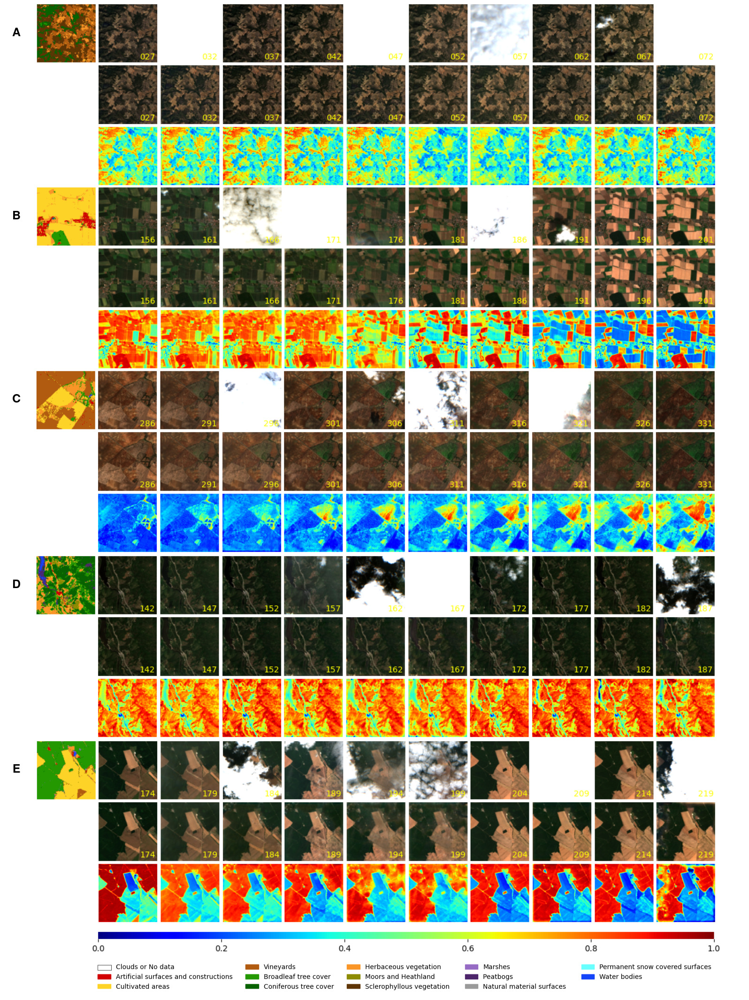

# Spatio-Temporal Generative Networks for Earth Surface Gap Filling

# Abstract

Earth observation from satellite sensors allows us to monitor natural ecosystems by deriving spatially explicit and temporally resolved biogeophysical parameters. Optical remote sensing, however, suffers from missing data mainly due to the presence of clouds, sensor malfunctioning, and atmospheric conditions. This study proposes a novel deep learning architecture to address remote sensing data gap filling and illustrate its performance at high-resolution Sentinel-2 data. Unlike previous works, we introduce a GAN-based architecture capable of sequence-to-sequence translation, which comprises Convolutional LSTM layers to effectively exploit complete dependencies in space-time series data. We focus on Sentinel-2 data over Europe and evaluate the method’s performance quantitatively (through distortion and perceptual metrics) and qualitatively (via visual inspection and visual quality metrics). The proposed methodology outperforms state-of-the-art methods and the model effectively removes various noise sources, such as clouds and missing data, offering a robust solution in a wide variety of scenarios and settings. We also illustrate and quantify the quality of the generated product in the relevant downstream application of vegetation greenness forecasting. This research contributes to enhancing the utility of EO data by providing a robust approach to gap-filling, ensuring its continued importance in monitoring and sustainable planet management.

# Results

<b>Example images showing the Seq2Seq reconstruction on different land covers.</b>For each example, the first row shows the land cover
map followed by ten original time steps of a sequence while the second row corresponds to its noise-free version. All images are noted with the
day-of-year (DOY). The third row illustrates the NDVI maps for the noise-free images. (A) Sequence with predominant herbaceous, sclerophyllous
vegetation and heavily occluded frames. (B) Sequence with mostly cultivated areas to show the performance on fast changes in the Earth’s surface.
(C) Sequence with widespread vines characterized by a rapid evolution of the land cover. (D) Predominant coniferous tree cover with a water
body nearby. (E) Sequence with predominant broadleaf tree cover and several consecutive time steps with dense occlusions.

# Data and code availability

The source code will be made available upon acceptance of the paper.
